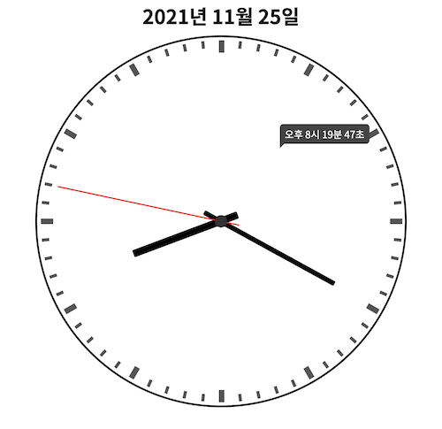

# Analog Clock Project



<br>

## Tech Stack

- `TypeScript`
- `React`
- `styled-components`
- `webpack / babel`
- `react-redux`
- `redux-saga`

<br>

## Install & Execute

- install

  ```bash
  $ npm install
  ```

- build

  ```bash
  $ npm run build
  ```

- execute dev server

  ```bash
  $ npm run dev
  ```

<br>

## Structure

```
├── src
│   ├── __test__ -- redux 상태 관리와 각종 util 함수 test 코드들
│   │   ├── clock.test.ts
│   │   └── utils.test.ts
│   ├── components
│   │   ├── Clock -- 시계의 시, 분, 초침 컴포넌트와 툴팁 컴포넌트 (상태와 관련 O)
│   │   │   ├── Clock.styled.ts
│   │   │   └── index.tsx
│   │   ├── ClockBody -- 시계의 외관 컴포넌트 (상태와 관련 X)
│   │   │   ├── Body.styled.ts
│   │   │   ├── Indicator.tsx
│   │   │   └── index.tsx
│   │   ├── Day -- 날짜 표시 컴포넌트
│   │   │   ├── Day.styled.ts
│   │   │   └── index.tsx
│   │   └── Main
│   │       ├── App.tsx : mount 시 상태 업데이트 시작
│   │       └── index.tsx
│   ├── index.tsx
│   ├── saga -- redux saga middleware : 1초 마다 상태 업데이트를 위한 미들웨어
│   │   ├── clock.ts
│   │   └── index.ts
│   ├── store -- redux store : 날짜와 시간 상태 관리
│   │   ├── clock.ts
│   │   └── index.ts
│   ├── style
│   │   └── global.ts
│   └── utils : 날짜와 시간을 통해 각종 값을 얻기 위한 유틸함수 모음 파일
│       └── index.ts
├── jest.config.js -- jest 설정 파일
├── package-lock.json
├── package.json
├── public
│   └── index.html
├── tsconfig.json -- typescript 설정 파일
└── webpack.config.js -- webpack 설정 파일
```